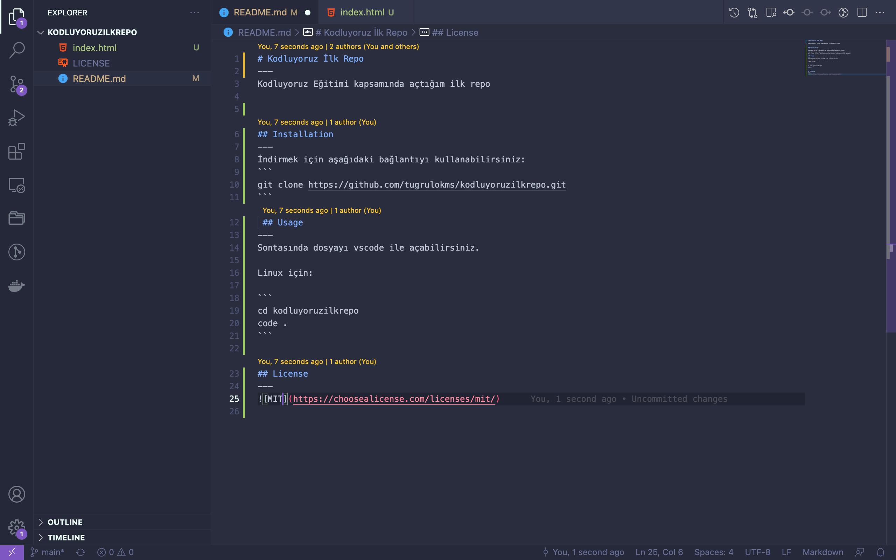

# Kodluyoruz İlk Repo

Kodluyoruz Eğitimi kapsamında açtığım ilk repo


## Installation
İndirmek için aşağıdaki bağlantıyı kullanabilirsiniz:
```
git clone https://github.com/tugrulokms/kodluyoruzilkrepo.git
```
## Usage

Sontasında dosyayı vscode ile açabilirsiniz.

Linux için:

```
cd kodluyoruzilkrepo
code .
```

## License

[MIT](https://choosealicense.com/licenses/mit/)


